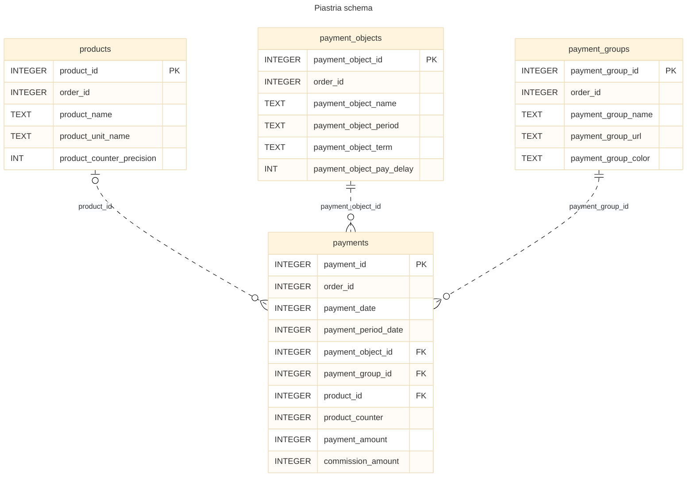

# Tables
| Table | Columns | Primary key | References | Referenced by |
| - | - | - | - | - |
| products | 5 | product_id | - | payments |
| payment_objects | 6 | payment_object_id | - | payments |
| payment_groups | 5 | payment_group_id | - | payments |
| payments | 10 | payment_id | payment_groups, payment_objects, products | - |
